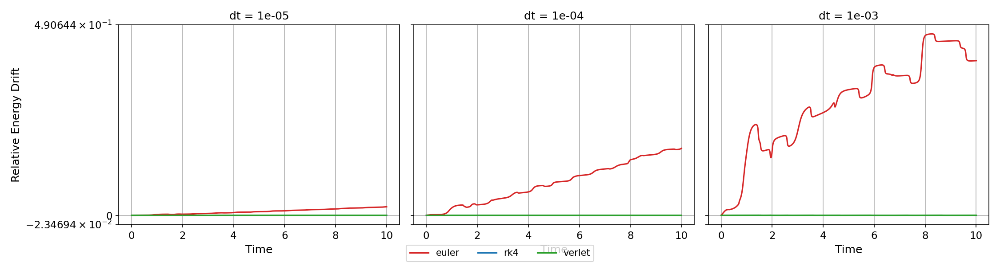
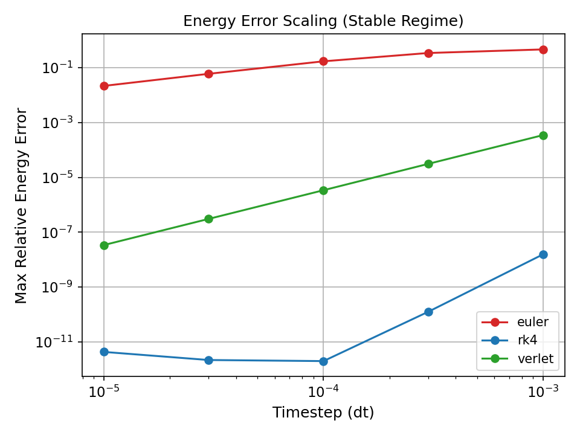
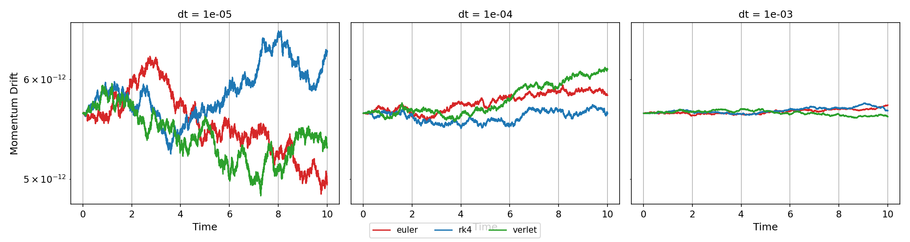
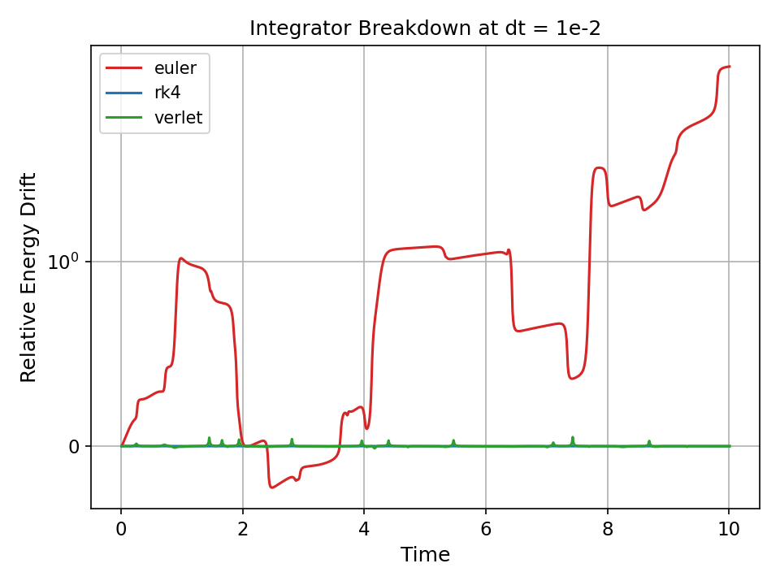
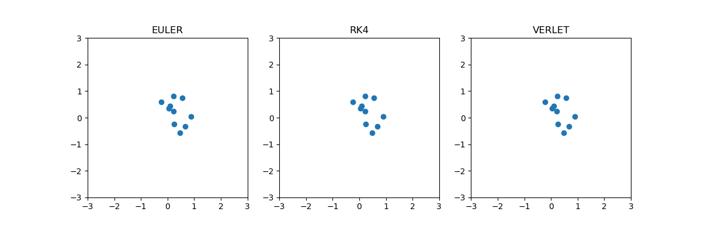

# Numerical Integrator Comparison for Interacting Particle Systems

## Overview

This project investigates the numerical behaviour of common time integration schemes applied to a 2D N-body interacting particle system. The focus is on comparing stability, accuracy, and preservation of physical invariants across three integrators: Forward Euler, Fourth-order Runge–Kutta (RK4), and Velocity Verlet.

The system incorporates Coulomb interactions, with optional collisions, fusion, and electromagnetic fields. This provides a nonlinear and dynamically sensitive environment in which integrator differences become pronounced.

Accurate simulation of interacting systems is fundamental across physics, engineering, and quantitative finance. While higher-order integrators reduce local truncation error, they do not necessarily preserve global system properties such as energy and momentum over long time horizons.

This project evaluates the trade-off between local accuracy and long-term physical consistency, with particular emphasis on structure-preserving methods.

## System Model

The simulation models a set of charged particles evolving in continuous time under the following dynamics:

- Forces
    - Pairwise Coulomb interaction with softening to avoid singularities
    - External electric and magnetic fields
- Particle Interactions
    - Elastic collisions
    - Optional fusion based on relative kinetic and potential energy thresholds
- Dimensionality
    - Two-dimensional spatial domain

The system evolves through discrete timesteps using explicit numerical integrators.

## Mathematical Model

The system evolves a set of charged particles under Newtonian dynamics with electromagnetic and pairwise interaction forces.

For each particle $i$, the equation of motion is:
$$ m_i \dfrac{\mathrm{d}\vec{v}_i}{\mathrm{d}t} = \sum_{j\neq i} \vec{F}_{ij} + \vec{F}_i^{ext}$$

Pairwise Coulomb interaction (softened):
$$\vec{F}_{ij} = \dfrac{kq_iq_j}{(|\vec{r}_{ij}|^2 + \epsilon^2)^{3/2}} \vec{r}_{ij} $$

External Lorentz force:
$$\vec{F}_i^{ext}  = q_i(\vec{E} + \vec{v}_i \times \vec{B})$$

where:
- $\vec{r_{ij}} = \vec{r_i} - \vec{r_j}$
- $\epsilon$ is a softening parameter preventing singularities

Energy function:
$$E = \sum_{i} \dfrac{1}{2} m_i |\vec{v_i}|^2 + \sum_{i<j}\dfrac{kq_iq_j}{\sqrt{|\vec{r_{ij}}|^2 + \epsilon^2}}$$

## Integrators Implemented

Three integration schemes are implemented and compared:

- Forward Euler Method (1st order)
    - First-order explicit method
    - Computationally cheap but numerically unstable
- Runge–Kutta 4 (RK4) (4th order)
    - Fourth-order method with high local accuracy
    - Non-symplectic; does not preserve system structure
- Velocity Verlet (2nd order)
    - Second-order symplectic integrator
    - Preserves geometric structure and energy behaviour over long time horizons

These methods differ in:
- truncation error
- stability properties
- long-term conservation behaviour

## Experimental Setup

Simulations are conducted under controlled and reproducible conditions:

- Number of particles: 10
- Initial positions: Uniformly distributed in $[-2,2]^2$, subject to minimum separation
- Initial velocities: Uniform random distribution
- Charges: Randomly assigned $\pm1$
- Simulation horizon: $T=10$
- Timestep grid: 
    $dt \in \{10^{-5}, 3 \cdot 10^{-5}, 10^{-4}, 3 \cdot 10^{-4}, 10^{-3}, 10^{-2}\}$
- Metrics evaluated:
    - Relative energy drift
    - Relative momentum drift
    - Runtime

Collisions are enabled in baseline experiments; fusion is analysed separately for qualitative behaviour.

## Data Output Format

Each simulation produces a time-series dataset stored as a CSV file.

Each row corresponds to a single timestep and contains:

- `t`: simulation time
- `total_energy`: total system energy
- `Px`, `Py`: total momentum components
- Particle state variables:
    - `x_i`, `y_i`: particle positions
    - `vx_i`, `vy_i`: particle velocities
    - `alive_i`: binary indicator (used when fusion is enabled)

This structure allows direct computation of conservation diagnostics and cross-integrator comparison.

## Results
All figures can be found in `results/figures`, and animations may be found in `results/animations`

**Energy Conservation**



- Euler exhibits systematic, unbounded energy drift, consistent with first-order truncation error accumulation and lack of structural preservation.
- RK4 significantly reduces local truncation error and demonstrates strong convergence with decreasing timestep, though it does not guarantee long-term energy conservation due to its non-symplectic structure.
- Velocity Verlet maintains bounded oscillatory energy error over long time horizons, consistent with symplectic structure-preserving integration.

**Error Scaling**



Log–log analysis of maximum energy error against timestep shows:

- Euler: lowest convergence rate
- Verlet: intermediate scaling

The RK4 curve does not exhibit a clean power-law scaling across the full timestep range.

This is expected in the presence of non-smooth dynamics (collisions and discrete interaction events), which violate the smoothness assumptions required for classical Runge–Kutta convergence theory.

At small timesteps, the error approaches floating-point precision limits, leading to noise-dominated behaviour. At larger timesteps, interaction events are under-resolved, causing deviation from the asymptotic regime in which RK4 achieves its theoretical order of convergence.

The RK4 method does not exhibit a single consistent scaling regime across all timesteps. This reflects a mixture of non-smooth interaction events, timestep-dependent resolution of collisions, and floating-point saturation at small error scales.

**Error Convergence**

Using a restricted timestep regime where numerical instability and floating-point saturation are reduced, the following convergence rates are observed:

- Euler: $\mathcal{O}(dt^{0.68})$
- Velocity Verlet: $\mathcal{O}(dt^{2.01})$
- RK4: $\mathcal{O}(dt^{3.90})$

These results are broadly consistent with the expected theoretical orders of 1, 2, and 4 respectively, with deviations attributable to non-smooth interaction dynamics, collision events, and finite precision effects.

The Euler method shows the largest deviation from asymptotic behaviour, indicating that the timestep range is not fully within its convergence regime.

**Momentum Conservation**



Momentum is analytically conserved for pairwise internal forces. Observed drift arises from numerical integration error and finite precision effects, with magnitude depending on timestep and method.

- Drift increases with the number of timesteps due to cumulative floating-point error
- All integrators display this behaviour, though magnitude varies

This reflects numerical accumulation rather than a fundamental failure of the methods.

**Breakdown Regime**



At large timestep ($dt=10^{-2}$)
- All integrators become unstable
- Energy error grows rapidly and unboundedly
- Particle trajectories lose physical meaning

This regime corresponds to numerical instability where timestep resolution becomes insufficient to resolve interaction scales, leading to divergence in the discrete dynamics.

**Runtime analysis**

- Runtime scales approximately inversely with timestep, since smaller timesteps require more integration steps over a fixed simulation horizon.
- RK4 is the most computationally expensive method per step due to multiple force evaluations within each update.
- Velocity Verlet has intermediate cost, while Euler is the cheapest per step due to its single force evaluation structure.
- Observed timings are consistent with differences in per-step computational complexity, though implementation details also contribute.

**Qualitative Behaviour (Fusion Sensitivity)**



In simulations with fusion enabled:

- The system exhibits qualitative sensitivity in threshold-dependent dynamics, where integrator choice alters whether fusion threshold conditions are met.
- Small trajectory deviations alter whether fusion thresholds are met

This highlights sensitivity to numerical error in nonlinear systems.

## Key Insight

Higher-order local accuracy does not imply superior long-term physical fidelity.

While RK4 minimises truncation error at each timestep, it does not preserve symplectic structure and therefore fails to maintain bounded energy behaviour over extended simulations.

In contrast, Velocity Verlet preserves geometric properties of Hamiltonian-like systems, resulting in more stable long-term dynamics despite lower formal order.

This demonstrates that integrator selection must be aligned with the governing objective: accuracy of short-term trajectories versus preservation of global invariants.

## Project Structure

```
project/
│
├── src/
│   ├── simulator.py      # Core particle system + physics
│   ├── integrators.py    # Euler, Verlet, RK4 implementations
│   ├── experiments.py    # Generates CSV data
│   ├── metrics.py        # Integration evaluation metrics
│   ├── plots.py          # Generate comparison plots
│   └── visualiser.py     # Optional visualisation
│
├── results/
│   │
│   ├── animations/
│       └── *.gif         # Simulation visualisations
│   │
│   ├── data/
│       └── *.csv         # Simulation outputs
│   │
│   └── figures/
│       └── *.png         # Simulation comparison plots
│
├── notebooks/
│   └── analysis.ipynb    # Analysis
│
├── environment.yml
├── LICENSE
├── .gitignore
└── README.md
```

## Reproducibility

Environment Setup
```
conda env create -f environment.yml
conda activate <env-name>
``` 

Running Experiments
```
python src/experiments.py

```
Generating Plots
```
python src/plots.py
```
Generating Animations (Optional)
```
python src/visualiser.py
```

All requirements can be found in `environment.yml`

## Limitations and Extensions
- The system is restricted to two dimensions
- Collision handling introduces non-smooth dynamics, affecting convergence analysis
- RK4 implementation includes overhead from deep copies, impacting runtime comparisons

This project focuses on numerical behavior, not high-performance optimization.
For large $N$, complexity is $\mathcal{O}(n^2)$ due to pairwise force computation.

## Conclusion

| Method | Stability Limit | Energy Growth | Convergence |
| ------ | --------------- | ------------- | ----------- |
| Euler  | Low             | High          |    0.68     |
| RK4    | Medium-high     | Bounded       |    3.90     |
| Verlet | High            | Bounded       |    2.01     |

The choice of numerical integrator materially affects both quantitative accuracy and qualitative system behaviour. RK4 provides superior local accuracy, but Velocity Verlet offers better long-term stability and physical fidelity. Euler is unsuitable for reliable simulation in this context.

This demonstrates that integrator selection must be aligned with the objectives of the simulation, particularly when conservation laws and nonlinear interactions are central.

These results highlight the distinction between numerical accuracy and physical fidelity in nonlinear dynamical systems.